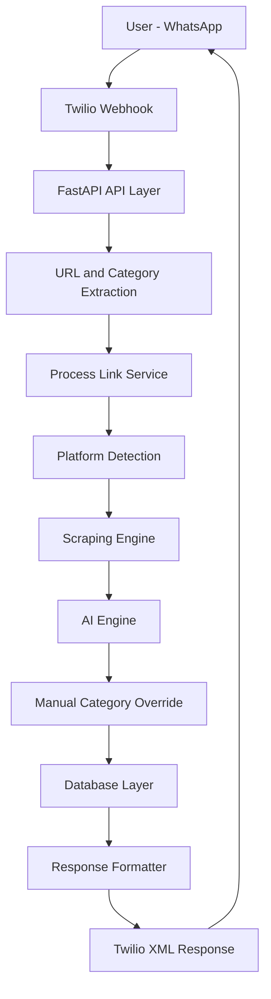
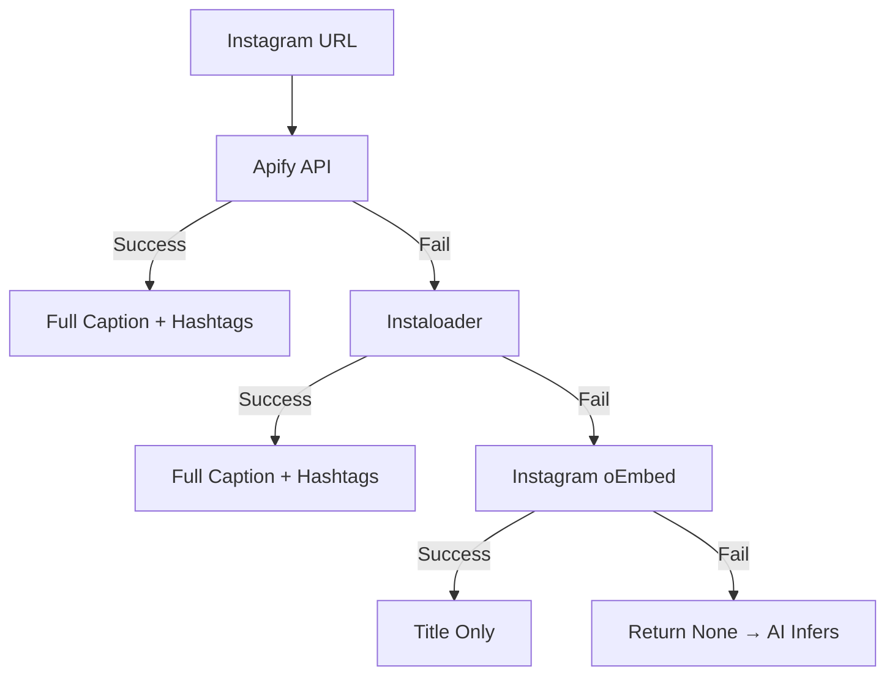
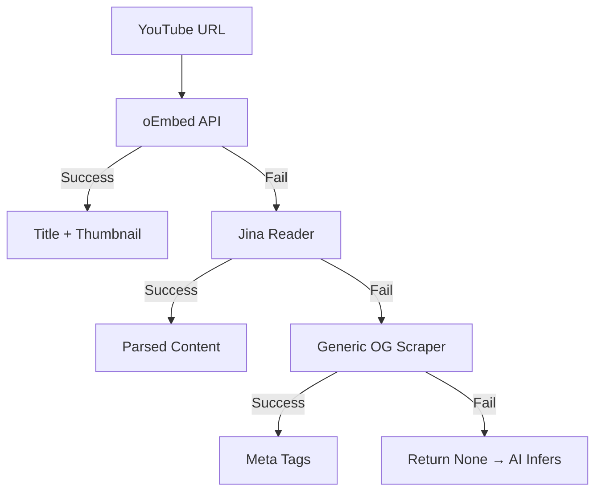
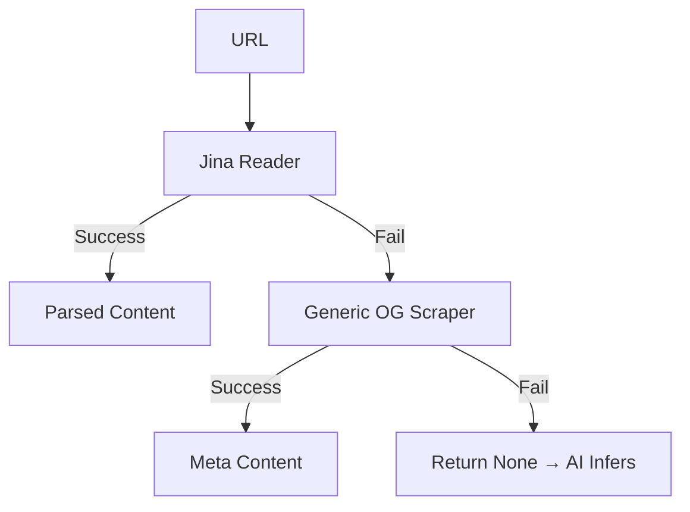
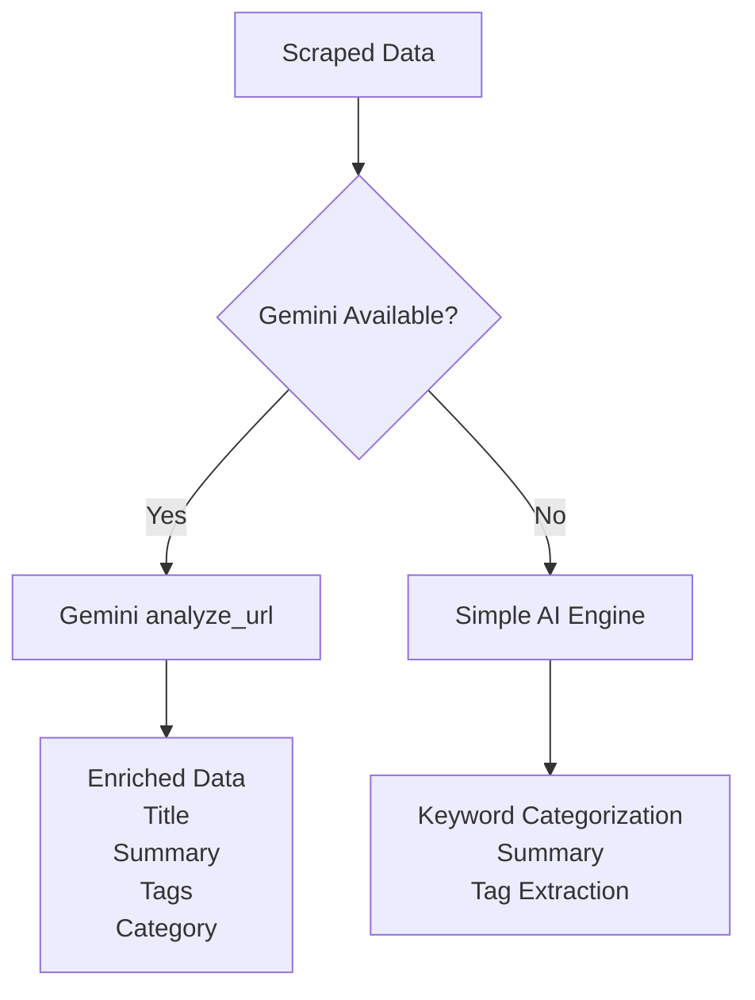
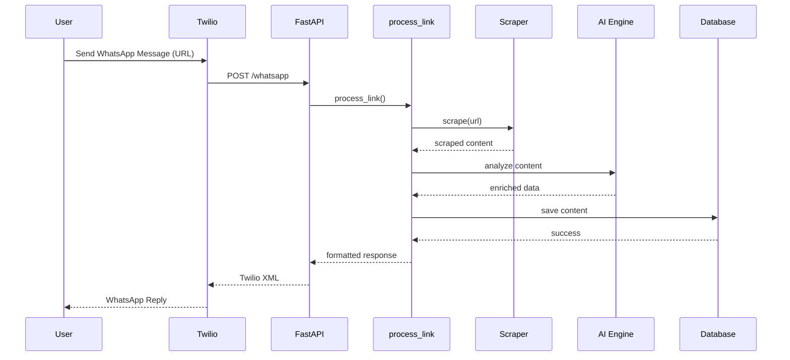
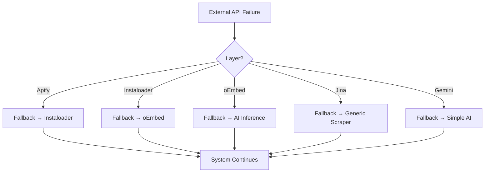
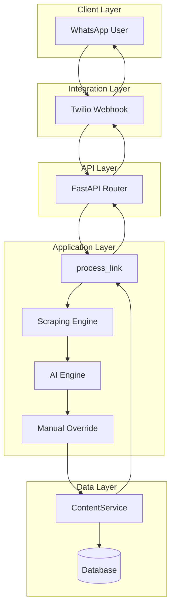

---

# 📦 Social Saver

### WhatsApp-Powered Content Intelligence Engine

Save, categorize, and summarize social media links directly from WhatsApp using multi-layer scraping + AI enrichment.

---

## 🚀 Overview

**Social Saver** is a production-ready backend system that:

* Accepts social media URLs via WhatsApp
* Extracts real content using platform-aware scraping
* Uses AI to summarize and categorize content
* Supports manual category override via hashtags
* Stores structured content in a database
* Responds instantly inside WhatsApp

---

## 🏗 High-Level Architecture



---

# 🔎 Scraping Engine (Multi-Tier Fallback Design)

The scraping layer is platform-aware and uses cascading fallbacks to ensure resilience.

---

## 📸 Instagram Scraping Flow



### Fallback Logic

* Missing API token → Skip Apify
* Apify free limit hit → Instaloader
* Instaloader rate-limit → oEmbed
* All fail → AI infers from URL

Instagram intentionally does **not** use generic scraping due to login wall restrictions.

---

## 🎥 YouTube Scraping Flow



---

## 🐦 Twitter / Articles / Other



---

# 🤖 AI Engine (Primary + Fallback)

After scraping, AI enrichment begins.



### AI Failure Handling

* Gemini unavailable → SimpleAI
* Invalid AI category → Default `OTHER`
* Scraping empty → AI infers from URL

---

# 🔁 End-to-End Sequence Diagram



---

# 🛡 System Fault Tolerance Map



---

# 🏗 Layered Architecture View



---

# 🏷 Manual Category Override

Users can force categorization:

```
https://youtube.com/... #coding
https://instagram.com/... #fitness
```

Supported tags:

* #fitness
* #coding
* #food
* #travel
* #design
* #fashion
* #business
* #education
* #entertainment

Manual override always takes priority over AI classification.

---

# 📂 Project Structure

```
```
social-saver-bot/
├── backend/
│   ├── app/
│   │   ├── main.py
│   │   ├── models/
│   │   ├── services/
│   │   └── api/
│   ├── requirements.txt
│   └── .env
├── frontend/
    ├── src/
    ├── public/
    ├── package.json
    └── tailwind.config.js

```
```

---

# 🔧 Environment Variables

Create a `.env` file:

```
APIFY_API_TOKEN=your_apify_token
GEMINI_API_KEY=your_gemini_key
DATABASE_URL=your_database_url
TWILIO_ACCOUNT_SID=your_sid
TWILIO_AUTH_TOKEN=your_token
```

---

# ▶ Running the Server

Install dependencies:

```
pip install -r requirements.txt
```

Run locally:

```
uvicorn app.main:app --reload
```

Expose via ngrok:

```
ngrok http 8000
```

Set Twilio webhook to:

```
https://your-ngrok-url/whatsapp
```

---

# 📈 Production Characteristics

* Platform-specific scraping strategy
* Multi-tier fallback chains
* AI fallback system
* Graceful degradation
* Manual override support
* Modular service architecture
* Logging-based debugging
* Async-compatible processing

---

# 🧱 Architectural Classification

Layered Monolithic Architecture
Strategy-Based Scraping Engine
Multi-Level Fault Tolerance Design

---

